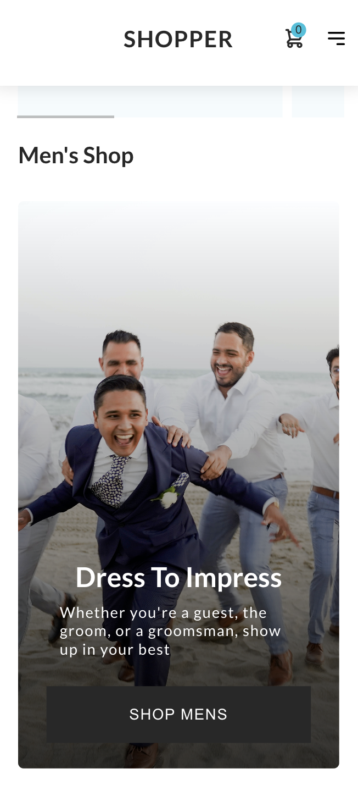
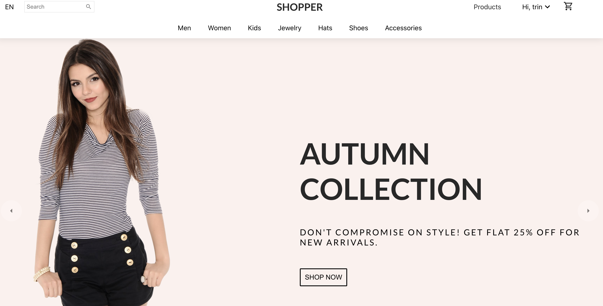

# App Description
- An e-commerce web-application meant as a template for freelance clients & for my personal portfolio.  
- Users can authenticate, browse collections of products, & mock a purchase-flow.

CTABanner.jsx (Mobile View)        |  Landing.jsx (Mobile View)
:-------------------------:|:-------------------------:
  |  

#### Landing.jsx (Desktop View)

## Table of Contents:
* [Limitations](#limitations--future-iterations)
* [Deployment](#Deployment)
* [Cloning Instructions](#cloning-instructions)
* [Usage Instructions](#usage-instructions)
* [Tech Stack](#tech-stack)
* [User Flows](#user-flows)
* [ERD](#erd--system-design)
* [Web Architecture](#web-architecture)
* [Dependencies](#dependencies)
* [Scripts](#available-scripts)

## Limitations & Future Iterations:

- Catch-All approach (client-side routing) in React-router equates to terrible SEO
    - Possible Solution: SSR or Isomorphic routing to optimize SEO 

## Deployment:

- Limited Deploy: (https://shopper-react.onrender.com/)
- **For full experience, follow cloning instructions below**

## Cloning Instructions:
- 1) See Github.com instructions on cloning @ { https://docs.github.com/en/repositories/creating-and-managing-repositories/cloning-a-repository }

- 2) In the terminal for the project, `npm i dotenv` to install .env.
    - 1a) Create a .env file
    - 1b) `npm i node-modules` In the terminal

- 3) Create a free account at Stripe via { https://dashboard.stripe.com/login }
    - Once you have an account, follow instructions to generate keys

- 4) In another terminal, run `npm run start:dev` to start up the Express server.  See [package.json](https://github.com/tpadilla10117/Shopper.com/blob/main/package.json) for more information.

- 5) Install & Configure PostgreSQL: { https://www.postgresql.org/download/ }

- 6) Once your PostgreSQL is configured & downloaded, in a separate terminal, create a database with the command: `createdb e-commerce_nodejs_template`

- 7) Once the database is configured, run the command `npm run seed:dev` to seed the PostgreSQL database with Products.  See [Seed.js](https://github.com/tpadilla10117/Shopper.com/blob/main/src/backend/Seed.js) for more information.

- 8) In another terminal, run the command `npm run start:react` to launch the User Interface.  See [package.json](https://github.com/tpadilla10117/Shopper.com/blob/main/package.json) for more information.

- 9) **MISSION CRITICAL STEP:** Local/development environments need to be updated so user's can run project locally

    - a) Create a local url and save to an enviroment variable e.g. *https://localhost:3000*

        - Replace the *REACT_APP_WEB_APP_URL* with your newly created environment variable in the following files:

    - b) In your Environment Variables, create a *REACT_APP_SIGNING_SECRET_KEY* variable and assign it your Signing Secret Key from Stripe.com

    - c) In your Environment Variables, create a *REACT_APP_FRONTEND_URL* variable and assign it the url where you are running your ui 
        - e.g. *https://localhost:3001*

#### Stripe Processes

- 9) In another terminal, run `stripe listen --forward-to localhost:3000/api/webhook` for local environment 

- 10) Receive a `STRIPE_SIGNING_SECRET` and place into environment variable

- NOTES:

    - Once you have your secret API keys you can send requests from your application via a webhook.

    - Run `stripe listen --forward-to localhost:3000/api/webhook` for local environment -> receive a STRIPE_SIGNING_SECRET and place into environment variable

    - Important: You should never expose API keys on the client side in production code because anyone on the internet will have access to your secret key and can make requests with your account. It is however acceptable for the purpose of this application and testing since it won’t be widely available and we don’t expect you to have a backend server.

    - You should consider using environment variables or a key manager to avoid committing your secret API key to your git repository. Check the documentation for your hosting provider for how to do this.

## Usage Instructions:
#### User Checkout Flow:
- 1) Create an account via the 'Sign In' button / route at the top right corner of the page
    - Click 'Sign Up with email' -> **NOTE: ONLY USE MOCK/FAKE INFO.  DO NOT ENTER IN YOUR REAL PII(Personally Identifiable Information)**
    - Click the 'Continue' button
- 2) Browse the website for products you are interested in
    - When you locate a product, click the 'Add to Cart' button
- 3) Click the shopping-cart icon in the top-right corner of the screen
    - Adjust your totals as necessary
    - When you are ready, click the 'Checkout Now' button to launch a checkout session
- 4) When you are redirected to the Stripe Checkout Session:
    - Fill out the form **NOTE: ONLY USE MOCK/FAKE INFO.  DO NOT ENTER IN YOUR REAL PII(Personally Identifiable Information)**
    - For payments use: `4242 4242 4242 4242` for card number -> this is to process a payment in Test Mode.
- 5) After a successful checkout, you will be redirected to a 'Success Page'.
    - Browse your orders via the 'Orders & Returns' tab under the navigation menu in the top-right portion of your screen

## Tech Stack:

#### Frontend JS Frameworks (Business Logic, UI):

| Framework & Libraries                         | Description 
| ---------------------------------- |-------
| [React.js](https://reactjs.org/) | Main structure of frontend application logic, including user experience and backend communication
| [Redux](https://redux.js.org/) | Open-source JavaScript library for managing and centralizing application state. It is most commonly used with libraries such as React or Angular for building user interfaces.

#### Frontend CSS Frameworks & Libraries (UI):

| Framework & Libraries                         | Description 
| ---------------------------------- |-------
| [Sass](https://sass-lang.com/libsass) | An enhanced version of css, allowing for programmatic, extendible, compiled css (sass/scss).  SASS ('Syntactically Awesome Style Sheets'): an extension of CSS that enables you to use things like variables, nested rules, inline imports and more. It also helps to keep things organised and allows you to create style sheets faster.
| [MaterialUI](https://mui.com/) | MUI offers a comprehensive suite of UI tools to help you ship new features faster. Start with Material UI, our fully-loaded component library, or bring your own design system to our production-ready components.

#### Backend:

| Framework & Libraries                         | Description 
| ---------------------------------- |-------
| [Node.js](https://nodejs.org/en/) | Underlying runtime environment which executes javascript server code
| [Express.js](https://expressjs.com/) | Server web application framework & REST API.  Express is a minimal and flexible Node.js web application framework that provides a robust set of features for web and mobile applications.
| [PostgreSQL](https://www.postgresql.org/) | PostgreSQL, also known as Postgres, is a free and open-source relational database management system emphasizing extensibility and SQL compliance. 

#### Third-Party APIs / Integrations:

| Integration                       | Description 
| ---------------------------------- |-------
| [Stripe](https://stripe.com/docs/development/get-started) | Stripe is a suite of APIs powering online payment processing and commerce solutions for internet businesses of all sizes. Accept payments and scale faster.

## User Flows:
#### Main Purchase Flow (User Checkout Flow):
.png)

## ERD & System Design:

## Web Architecture:

## Redux Flow (State Management):

## Dependencies & Installs:

##### For a full list of project dependencies:
- See [package.json](https://github.com/tpadilla10117/Shopper.com/blob/main/package.json)

| Dependencies                        | Description 
| ---------------------------------- |-------
| [node-modules](https://www.npmjs.com/package/node-modules) | Node.js module and cli tool for searching node-modules.com
| [nodemon](https://www.npmjs.com/package/nodemon) | Monitors files and auto restart server when changes made to server
| [cors](https://www.npmjs.com/package/cors) | CORS is a node.js package for providing a Connect/Express middleware that can be used to enable CORS with various options.  Use command `npm i cors` to install.  { https://en.wikipedia.org/wiki/Cross-origin_resource_sharing }
| [axios](https://www.npmjs.com/package/axios) | Promise based HTTP client for browser and node.js.  Use command `npm i axios` to install.
| [PostgreSQL](https://www.postgresql.org/) | PostgreSQL, also known as Postgres, is a free and open-source relational database management system emphasizing extensibility and SQL compliance.  Use command `npm i pg` to install.
| [Jest](https://jestjs.io/) | Jest is a delightful JavaScript Testing Framework with a focus on simplicity.  It works with projects using: Babel, TypeScript, Node, React, Angular, Vue and more!.  Use command `npm i --save-dev jest` to install.
| [morgan](https://www.npmjs.com/package/morgan) | HTTP request logger middleware for node.js.  Use command `npm i morgan` to install.
| [body-parser](https://www.npmjs.com/package/body-parser) | Node.js body parsing middleware.  Parse incoming request bodies in a middleware before your handlers, available under the req.body property.  Use command `npm i body-parser` to install.
| [Express.js](https://expressjs.com/) | Server web application framework & REST API.  Express is a minimal and flexible Node.js web application framework that provides a robust set of features for web and mobile applications.  Use command `npm i express` to install.
| [bcrypt](https://www.npmjs.com/package/bcrypt) | A library to help you hash passwords.  You can read about bcrypt on [Wikipedia](https://en.wikipedia.org/wiki/Bcrypt) as well as [How To Safely Store A Password](https://codahale.com/how-to-safely-store-a-password/) Use command `npm i bcrypt` to install.
| [Sass](https://sass-lang.com/libsass) | An enhanced version of css, allowing for programmatic, extendible, compiled css (sass/scss).  SASS ('Syntactically Awesome Style Sheets'): an extension of CSS that enables you to use things like variables, nested rules, inline imports and more. It also helps to keep things organised and allows you to create style sheets faster.  Use command `npm install sass` to install.
| [MaterialUI](https://mui.com/) | MUI offers a comprehensive suite of UI tools to help you ship new features faster. Start with Material UI, our fully-loaded component library, or bring your own design system to our production-ready components.
| [jsonwebtoken](https://www.npmjs.com/package/jsonwebtoken) | An implementation of [jsonwebtoken](https://www.rfc-editor.org/rfc/rfc7519).  Use command `npm i jsonwebtoken` to install.
| [classnames](https://www.npmjs.com/package/classnames) | A simple JavaScript utility for conditionally joining classNames together.  Use command `npm i classnames` to install.
| [dotenv](https://www.npmjs.com/package/dotenv) | To load environment variables from `.env` file to `process.env` object.  Dotenv is a zero-dependency module that loads environment variables from a .env file into process.env. Storing configuration in the environment separate from code is based on The Twelve-Factor App methodology.  Use command `npm i dotenv` to install.
| [react-redux](https://react-redux.js.org/introduction/getting-started) | React Redux is the official React UI bindings layer for Redux. It lets your React components read data from a Redux store, and dispatch actions to the store to update state.  Use command `npm install react-redux` to install.
| [Redux](https://redux.js.org/introduction/getting-started) | Redux is a predictable state container for JavaScript apps.  It helps you write applications that behave consistently, run in different environments (client, server, and native), and are easy to test. On top of that, it provides a great developer experience.  Use command `npm install @reduxjs/toolkit` to install.
| [redux-persist](https://www.npmjs.com/package/redux-persist) | Persist and rehydrate a redux store.  Use command `npm i redux-persist` to install.
| [reselect](https://www.npmjs.com/package/reselect) | A library for creating memoized "selector" functions. Commonly used with Redux, but usable with any plain JS immutable data as well.  Use command `npm i reselect` to install.
| [react-transition-group](https://www.npmjs.com/package/react-transition-group) | Exposes simple components useful for defining entering and exiting transitions. React Transition Group is not an animation library like React-Motion, it does not animate styles by itself. Instead it exposes transition stages, manages classes and group elements and manipulates the DOM in useful ways, making the implementation of actual visual transitions much easier.  Use command `npm install react-transition-group` to install.
| [react-scroll](https://www.npmjs.com/package/react-scroll) | React component for animating vertical scrolling.  Use command `npm i react-scroll` to install.
| [react-intersection-observer](https://www.npmjs.com/package/react-intersection-observer) | React implmentation of the Inersection Observer API to tell you when an element enters or leaves the viewport.  Use command `npm i react-intersection-observer` to install.
| [react-currency-format](https://www.npmjs.com/package/react-currency-format) | For currency fortmatter dependency.  Use command `npm install react-currency-format` to install.
| [React Router Dom](https://www.npmjs.com/package/react-router-dom) | The react-router-dom package contains bindings for using React Router in web applications.  Use command `npm install react-router-dom` to install.
| [Email JS](https://www.emailjs.com/docs/sdk/installation/) | Email.js (email server provider library).  Use command `npm i emailjs.com` to install.
| [Moment](https://www.npmjs.com/package/moment) | A JavaScript date library for parsing, validating, manipulating, and formatting dates.  Use command `npm install moment` to install.
| [Stripe](https://www.npmjs.com/package/stripe) | The Stripe Node library provides convenient access to the Stripe API from applications written in server-side JavaScript.  For collecting customer and payment information in the browser, use [Stripe](https://stripe.com/docs/js)  Use command `npm install --save stripe` to install.
| [Stripe,js ES Module](https://www.npmjs.com/package/@stripe/stripe-js) | Make server-side requests to to Stripe API and to provide methods for including Stripe.js in client-side code.  Use Stripe.js as an ES module.  Note: To be PCI compliant, you must load Stripe.js directly from https://js.stripe.com. You cannot include it in a bundle or host it yourself. This package wraps the global Stripe function provided by the Stripe.js script as an ES module.  Use command `npm install @stripe/stripe-js` to install.
| [React Stripe.js](https://www.npmjs.com/package/@stripe/react-stripe-js) | React Stripe.js is a thin wrapper around Stripe Elements.  It allows you to add Elements to any React app.  Use command `npm install --save @stripe/react-stripe-js` to install.
| [Markdown Notes Tree](https://github.com/mistermicheels/markdown-notes-tree) | If you have a folder structure with Markdown notes, you can use this tool to generate Markdown trees that act as a table of contents for the folder structure.  Use command `npm install -D markdown-notes-tree` to install.

## Available Scripts

In the project directory, you can run:

### `npm start:react`

Runs the app in the development mode.\
Open [http://localhost:3000](http://localhost:3000) to view it in your browser.

The page will reload when you make changes.\
You may also see any lint errors in the console.

### `npm seed:dev`

Builds the pg database and seeds with initial data in development mode.

### `npm start:dev`

Runs the API in development mode.

### `npm test`

Launches the test runner in the interactive watch mode.\
See the section about [running tests](https://facebook.github.io/create-react-app/docs/running-tests) for more information.

### `npm run build`

Builds the app for production to the `build` folder.\
It correctly bundles React in production mode and optimizes the build for the best performance.

The build is minified and the filenames include the hashes.\
Your app is ready to be deployed!

See the section about [deployment](https://facebook.github.io/create-react-app/docs/deployment) for more information.

### `npm run eject`

**Note: this is a one-way operation. Once you `eject`, you can't go back!**

If you aren't satisfied with the build tool and configuration choices, you can `eject` at any time. This command will remove the single build dependency from your project.

Instead, it will copy all the configuration files and the transitive dependencies (webpack, Babel, ESLint, etc) right into your project so you have full control over them. All of the commands except `eject` will still work, but they will point to the copied scripts so you can tweak them. At this point you're on your own.

You don't have to ever use `eject`. The curated feature set is suitable for small and middle deployments, and you shouldn't feel obligated to use this feature. However we understand that this tool wouldn't be useful if you couldn't customize it when you are ready for it.

## Learn More

You can learn more in the [Create React App documentation](https://facebook.github.io/create-react-app/docs/getting-started).

To learn React, check out the [React documentation](https://reactjs.org/).

### Code Splitting

This section has moved here: [https://facebook.github.io/create-react-app/docs/code-splitting](https://facebook.github.io/create-react-app/docs/code-splitting)

### Analyzing the Bundle Size

This section has moved here: [https://facebook.github.io/create-react-app/docs/analyzing-the-bundle-size](https://facebook.github.io/create-react-app/docs/analyzing-the-bundle-size)

### Making a Progressive Web App

This section has moved here: [https://facebook.github.io/create-react-app/docs/making-a-progressive-web-app](https://facebook.github.io/create-react-app/docs/making-a-progressive-web-app)

### Advanced Configuration

This section has moved here: [https://facebook.github.io/create-react-app/docs/advanced-configuration](https://facebook.github.io/create-react-app/docs/advanced-configuration)

### Deployment

This section has moved here: [https://facebook.github.io/create-react-app/docs/deployment](https://facebook.github.io/create-react-app/docs/deployment)

### `npm run build` fails to minify

This section has moved here: [https://facebook.github.io/create-react-app/docs/troubleshooting#npm-run-build-fails-to-minify](https://facebook.github.io/create-react-app/docs/troubleshooting#npm-run-build-fails-to-minify)
